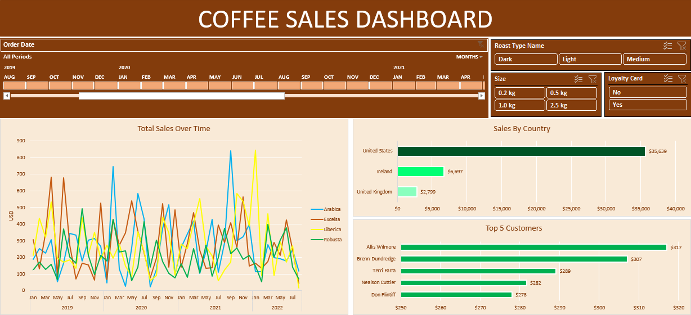

# Coffee Sales Dashboard

## Project Background
Maven Roasters is a coffee-shop chain with three locations (Astoria, Hell's Kitchen, Lower Manhattan) in New York City. This report uses transactional data encompassing **149116 records across 11 fields, from Jan-Jun 2023** to better understand purchase behaviour and streamline operations. The goal is to **transform the data into a dynamic dashboard that franchise owners can use to identify patterns, trends and opportunities for the business.**   
## Data Insights
* The price ranges from **80 cents (flavor shots)** to **45 USD (premium coffee beans).**
* Across the three locations:
  - The total revenue generated from January to June in 2023 was **6,98,812 USD,** the **highest being in June** and the **lowest in February.**
  - In **product category**, the highest selling item was **coffee** and the lowest selling was **packaged chocolate.**
  - In the top 15 product types, the highest selling item was **brewed chai tea** and the lowest selling was **sugar free syrup.**
  - In the top 15 product types, the highest revenue generating item was **barista espresso** and the lowest revenue generating was **sugar free syrup.**
## Recommendations
* In **Lower Manhattan** location, during **7-8 pm,** the sales are negligible. Hence the franchise owner should consider changing the operating hours to improve the margins.
