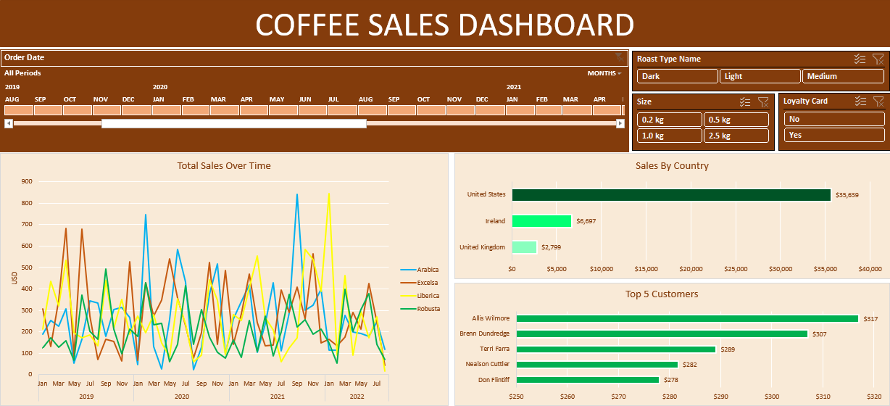

# Excel Projects
## Coffee Sales Dashboard

* **Project Description:** This project involves cleaning and transforming raw coffee survey data to prepare it for analysis. The dataset includes information on drinkers' preference, demographic, and brew preference, with 16 columns and 1k+ entries.  
* **Excel Skills Used:** XLOOKUP, INDEX, PIVOT TABLES, PIVOT CHARTS
